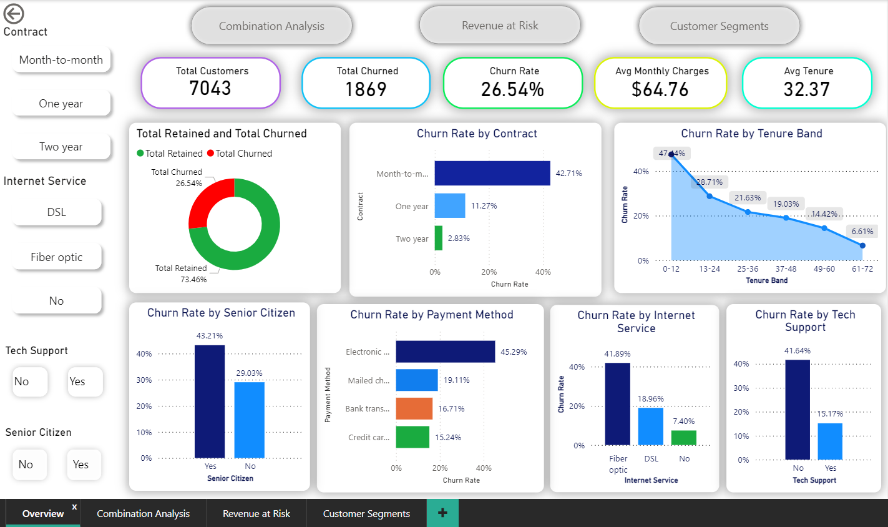

# Telco-Churn-Analysis

---

## About This Project

This is a data analysis project where I analyzed customer churn 
for a telecom company. Churn means customers who stopped using 
the service and left.

The main goal was to find out:
- Why are customers leaving?
- Who is most likely to leave?
- How much monthly revenue is being lost?
-Who are the most loyal customers and who are at high risk?

I used SQL to clean and analyze the data, Excel to organize the 
results into summary tables, and Power BI to build an interactive 
dashboard.

---

## Dataset

- **Name:** IBM Telco Customer Churn Dataset
- **Source:** [Kaggle](https://www.kaggle.com/datasets/blastchar/telco-customer-churn)
- **Size:** 7,043 customers, 21 columns
- **What it contains:** Customer details like contract type, 
  internet service, monthly charges, tenure, add-on services, 
  and whether they churned or not

---

## Tools Used

- **MySQL Workbench** — data cleaning and analysis using SQL queries
- **Microsoft Excel** — organizing results into 10 structured summary sheets
- **Power BI Desktop** — building a 4-page interactive dashboard with DAX measures

---

## How I Approached This Project

I followed a simple 3-step process:

**Step 1 — SQL Analysis**
I wrote SQL queries to clean the data and find churn patterns 
across different customer groups. Each query has written 
observations explaining what the result means in plain English. 
All queries are saved in the `Telco Churn Analysis.sql` file.

**Step 2 — Excel Summary**
I exported the SQL results into Excel and organized them into 
10 separate sheets — one for each area of analysis with clean 
tables and key observations.

**Step 3 — Power BI Dashboard**
I built a 4-page interactive dashboard using the raw dataset, 
DAX measures, and slicers for filtering. Calculated columns 
for Tenure Band and Senior Citizen labels were created inside 
Power BI.

---

## Data Cleaning

- Found **11 blank rows** in the TotalCharges column — removed 
  because those customers had zero tenure and incomplete data
- TotalCharges column was stored as text — converted to numeric 
  format for calculations
- Checked for duplicate customer records — none found
- **SeniorCitizen column** had 0 and 1 values — converted to 
  Yes and No using a calculated column in Power BI for better 
  readability in the dashboard
- **Tenure Band** grouping (0-12, 13-24, 25-36, 37-48, 49-60, 
  61-72 months) was applied using CASE WHEN logic inside SQL 
  queries and as a calculated column in Power BI

---

## Questions I Answered

1. Which contract type has the highest churn rate?
2. Does internet service type affect churn?
3. Does having tech support help retain customers?
4. Which payment method is most linked to churn?
5. Do new customers churn more than long-term customers?
6. Which add-on services protect against churn the most?
7. Who is the highest-risk customer profile?
8. How much monthly revenue is being lost to churn?
9. What do loyal customers (tenure 61+ months) have in common?

---

## Key Findings

- Month-to-month customers churn at **42.71%** — the highest 
  of any contract type. Two-year customers only churn at **2.83%**.

- Fiber optic users churn at **41.89%** — much higher than DSL 
  (18.96%) and customers with no internet (7.40%), suggesting 
  possible issues with pricing or service quality.

- Customers with no tech support churn at **41.64%** — almost 
  three times more than customers who have tech support (15.17%).

- Electronic check users have the highest churn at **45.29%**. 
  Customers on automatic payment methods stay longer and show 
  much lower churn.

- New customers in the 0-12 month band churn at **47.44%** — 
  the riskiest period. Churn drops steadily as customers stay longer.

- The most at-risk customer profile: month-to-month contract + 
  fiber optic + electronic check + no tech support + high monthly 
  charges = **74.4% churn rate**.

- Total monthly revenue at risk is approximately **$139,130**, 
  with month-to-month contracts alone contributing **$120,847**.

- **Online Security** is the most protective add-on service — 
  customers with it churn at only 14.61% compared to 41.77% 
  without it, a difference of 27.16 percentage points.

- Loyal customers (tenure 61+ months) make up **18.66%** of 
  the customer base. They are mostly on two-year contracts, use 
  automatic payment methods, and have tech support and security 
  add-ons.

- Customers with a partner show **29.54% loyalty rate** versus 
  just 8.49% for those without, making personal life factors a 
  meaningful indicator of loyalty.

---

## Dashboard

I built a 4-page interactive Power BI dashboard.

**[Download & View the Interactive .pbix File](Telco%20Churn%20Analysis.pbix)**
---

### Page 1 — Churn Overview

KPI cards showing total customers, churned customers, churn rate, 
average monthly charges, and average tenure. Bar charts showing 
churn rate by contract, internet service, payment method, tech 
support, senior citizen status, and tenure band. Includes a full 
slicer panel for interactive filtering.

---

### Page 2 — Add-ON and Combination Analysis

Clustered bar chart showing how each add-on service affects churn 
rate (with vs without the service). Four combination charts showing 
how contract + internet service, contract + payment method, contract 
+ tenure band, and internet service + tech support interact to affect 
churn together.

---

### Page 3 — Monthly Revenue at Risk

Four bar charts showing monthly revenue at risk due to churn, broken 
down by contract type, tenure band, internet service type, and 
payment method.

---

### Page 4 — Customer Segments

High Risk Customer Segments table with Critical, High, and Moderate 
risk labels based on churn rate. Loyal customer charts showing loyalty 
rate by contract type, tech support, payment method, partner status, 
and dependents.

---

## SQL Queries

All SQL queries are in the `Telco Churn Analysis.sql` file.

Each query includes a written observation in the comments 
explaining what the result means — not just the code.

The queries cover:

- Data exploration and cleaning
- Churn rate by contract type
- Churn rate by internet service type
- Churn rate by tech support
- Churn rate by payment method
- Churn rate by tenure band
- Churn rate by senior citizen status
- Add-on service ranking by churn impact
- Multi-dimension combination analysis
- High-risk customer profile with risk scoring (Critical, High, Moderate)
- Monthly revenue at risk by contract, tenure band, internet service, 
  and payment method
- Loyal customer profile analysis across 13 different factors

---

## Excel Workbook

The `Telco Churn Analysis.xlsx` file has 10 sheets:

| Sheet | What It Contains |
|-------|-----------------|
| Overview | Project summary and dataset info |
| Key Insights | Top findings from the analysis |
| Summary Stats | Overall churn rate, retention rate, and averages |
| Churn Rate by Factors | Churn breakdown by 6 individual factors |
| Add-ON Ranking | Add-on services ranked by churn impact |
| Combination Analysis | Multi-factor churn breakdown |
| High Risk Profile | High-risk customer segments with risk labels |
| Monthly Revenue at Risk | Revenue loss breakdown by 4 factors |
| Loyal Customers Segment | Loyal customer profile across 13 factors |
| TELCO Churn Dataset | Cleaned raw dataset |

---

## Files in This Repository
* **[Screenshots/](Screenshots/)**: Dashboard images.
* **[Telco Churn Analysis.sql](Telco%20Churn%20Analysis.sql)**: SQL script with analytical queries.
* **[Telco Churn Analysis.pbix](Telco%20Churn%20Analysis.pbix)**:Interactive Power BI Dashboard
* **[Telco Churn Analysis.xlsx](Telco%20Churn%20Analysis.xlsx)**: Summary workbook.
* **[Telco Churn Dataset.xlsx](Telco%20Churn%20Dataset.xlsx)**: Raw source data.

---

## About Me

I am a fresher transitioning into data analytics. My background 
is in Biotechnology (B.Tech, NIT Warangal, 2023). I am building 
hands-on portfolio projects to develop real-world skills in SQL, 
Excel, and Power BI.

**[LinkedIn](your-linkedin-url)** | **[GitHub](your-github-url)**
